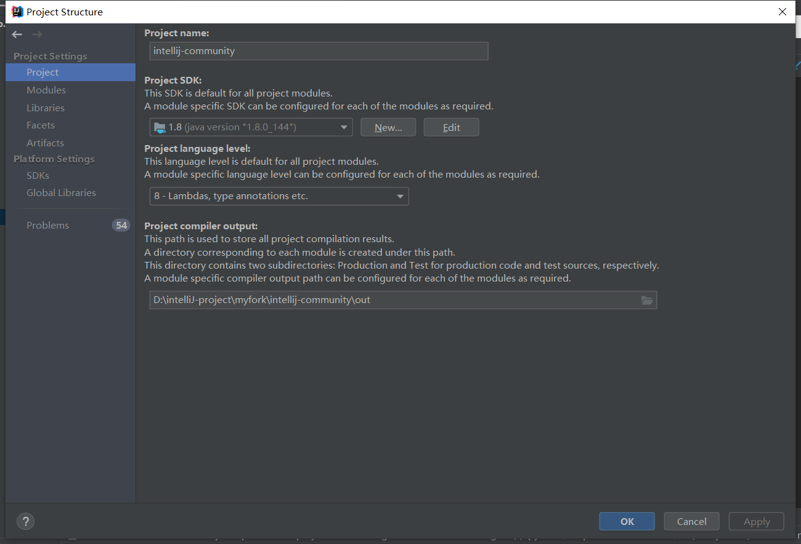
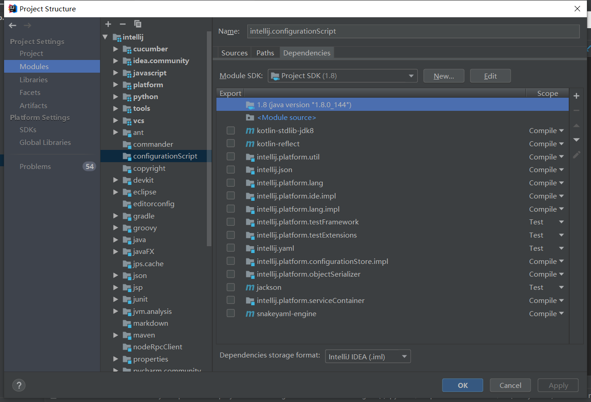
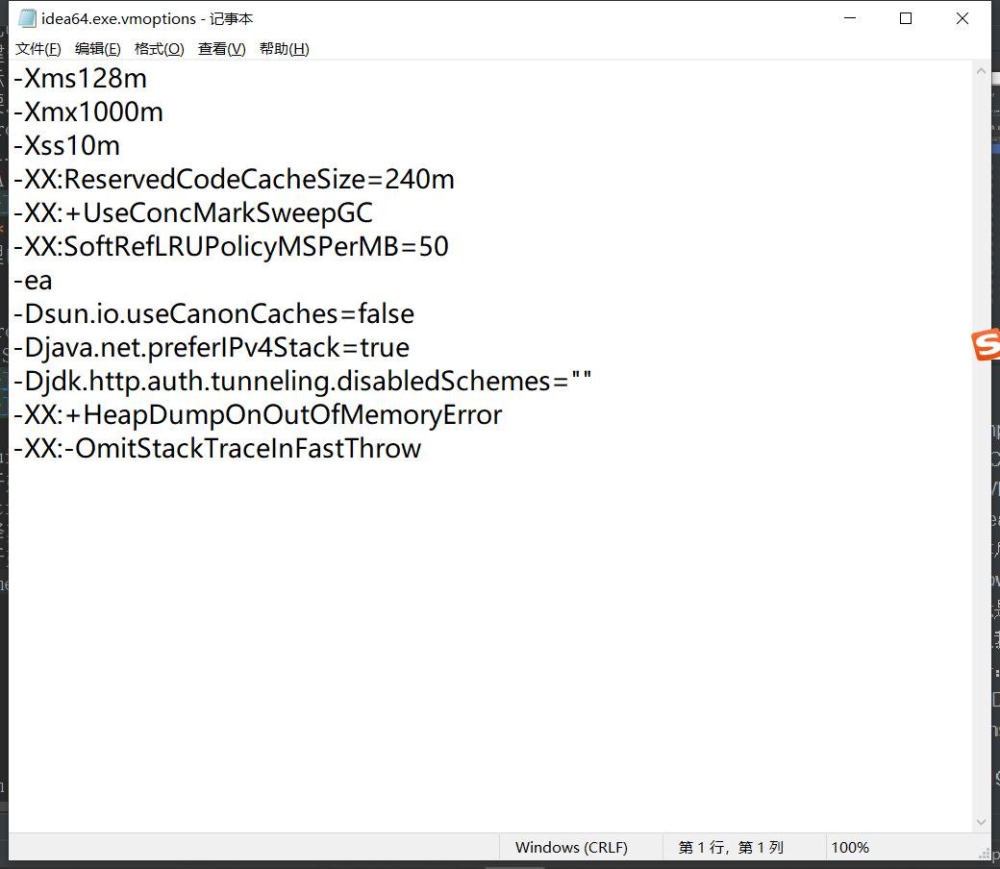
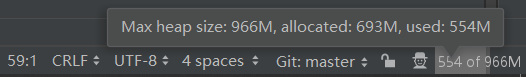
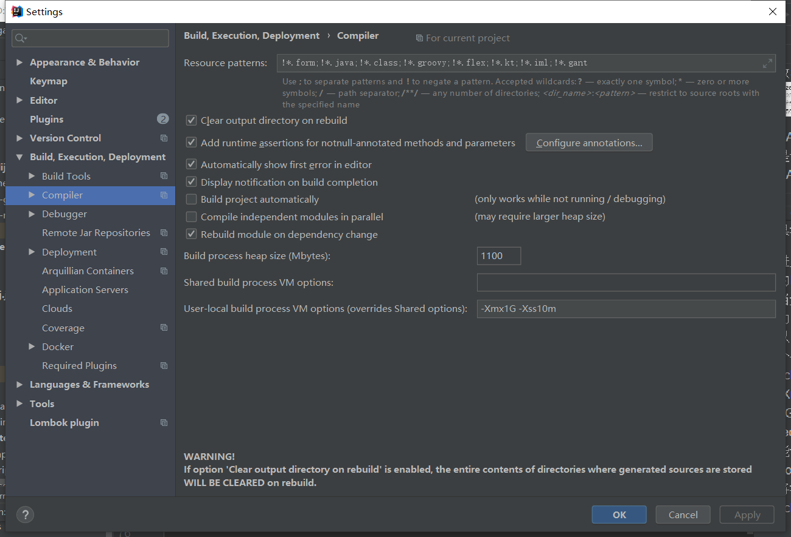
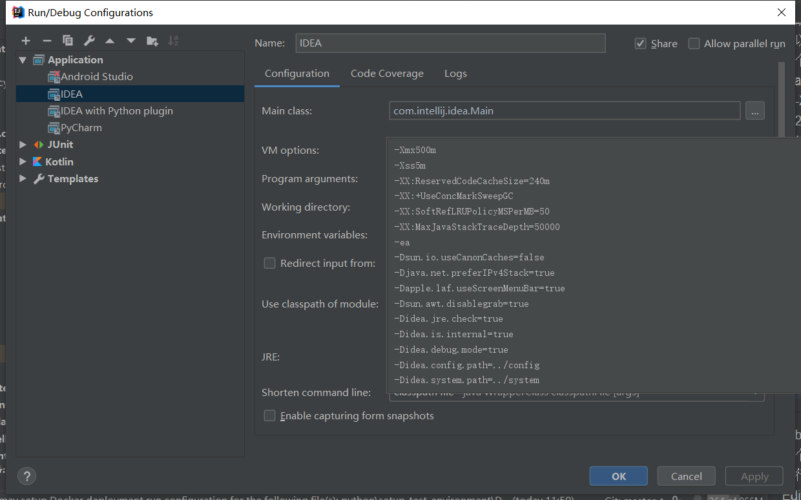
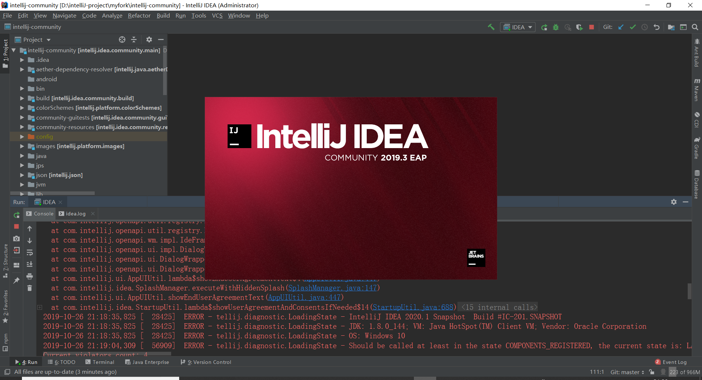
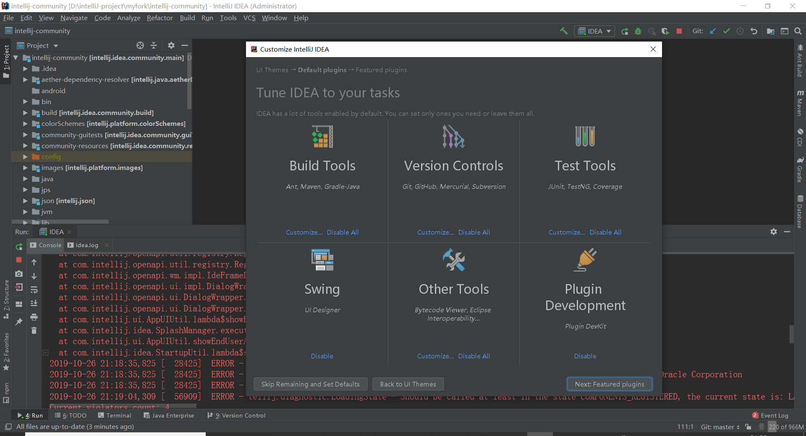
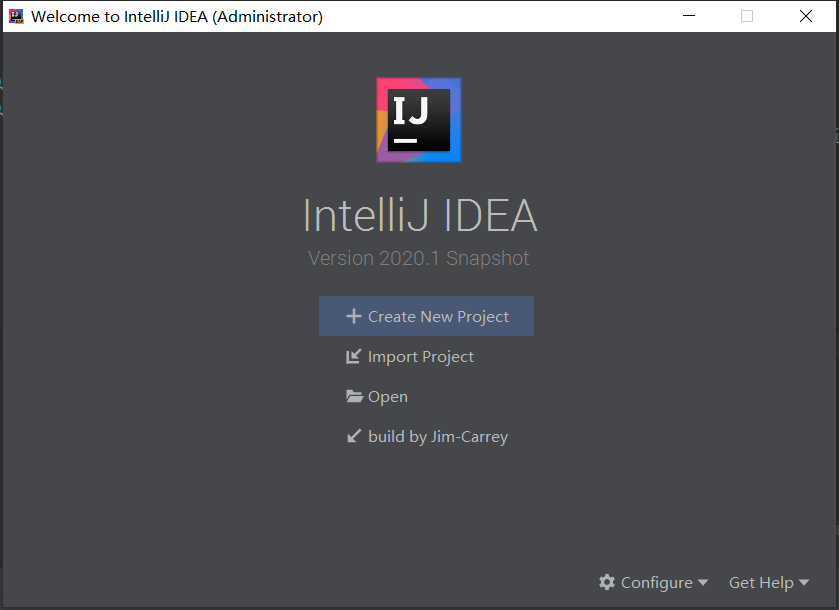

## 前言
IDEA作为Java世界的超级明星IDE 早就已经和我们平时的生产开发融为了一体
今天我们就用企业收费版build一下它的免费开源社区版
博主中途踩的坑记录于此，希望对读者们有帮助

---

## 正文

1.二话不说 先上JetBrains的GitHub库把开源版intellij-community拿下来（是否fork看你心情）
clone前请仔细阅读文档，完整的库有3G多，所以克隆的时候be patient,也可以clone readme里的depth1只有几百M
 

2.用本机ultimate IDEA导入，现在准备build（因为down的是源码所以用build方式构建项目）
如何构建一定要看项目的Readme
文档指示： 
分别需要JDK1.8和JDK1.6  
在项目Project Structure里设置项目 Platform SDK: 
设置JDK1.8  指向本机jdk1.8 
设置IDEA jdk 指向本机jdk1.6 
 
**注意**：这里需要将jdk/lib/tools.jar也添加到项目的SDK里（build项目时需要前端编译器javac，javac不在JRE下，而在jdk/lib/toos.jar里 
至于这里的IDEA jdk（jdk1.6）因为后期build的时候项目里有些代码需要1.6的sdk所以这里需要添加jdk1.6到IDEA jdk

然后将Project里的Project SDK设置为 JDK1.8 
Modules SDK设置成Project SDK（既JDK1.8） 
 
 

3.准备build 
接下来开始设置Compiler： 
打开Setting--Build--Compiler 
配置编译期启动的JVM参数（这个JVM用来Build我们的community版idea）
博主一开始没有改动这些默认值，然后。。然后，，他娘的编译了半个小时了突然StackOverFlowError..,我又重复build了好几次一直这个错误，就是因为JVM的参数给的不对（血的教训），后边我分析原因，搞清楚了这些参数到底哪个对应哪个： 

①位于{home}\IntelliJ IDEA 2019.1\bin下的idea64.exe.vmoptions
 
大概解释一下主要参数意思： 
-Xms JVM初始化堆大小 
-Xmx JVM最大堆大小 （如果运行期间，对象过多会导致OutOfMemoryError申请不到新heap空间 
-Xss JVM栈大小(方法调用太深，爬栈太深会导致StackOverFlowError栈堆溢出错误)
 

IDEA目录下idea64.exe.vmoptions这里边的参数是运行当前IDEA的这个JVM的参数，进入IDEA右下角看到的这个就是： 
 
如果看不到，请搜索开启memory indicator

②进入IDEA后Setting--Build--Compiler这个里边的heap size和 vm options是我们build项目时（当然这里肯定是指依赖于JVM的项目）需要启动的那个JVM的参数 
所以 在我们今天的编译build期，我们应该调整这个参数，上文提到我在build期间屡屡出现StackOverFlowError,然后我试图将堆加大，但是-Xmx默认是1/4的本机内存大小，我试图加到2G，也报错,报无法给出这么大的heap object 初始化失败
，尝试了几个参数，发现最大能调整到1200M,然后我在user local vm options里（默认会覆盖掉shared vm options ）将栈大小调到了10m  -Xss10m
最后解决掉了StackOverFlowError这个build期错误
 

③build完后接着就是run,run的时候也需要启动一个JVM（编译完community版后需要运行，运行需要的JVM），点开Build(小锤子)右边的Edit Configuration--run/debug configuration:  
 
这里面的vm options就是编译完run的时候即将要启动的JVM参数 
-Xmx 500m      -Xss 5m 
我给了500M的堆和5m的栈大小（OS大概能接收3000-5000个线程） 
**注意**：上图中的-XX:MaxJavaStackTraceDepth=50000 这个不是栈深，注意是trace，这个是追踪错误日志的爬栈条数（与栈大小没关系），栈的深度只与栈的总大小和入栈的每个栈帧的大小有关系

以上就是各个参数设置所对应的JVM
JVM这块还是要下很多功夫的，推荐书籍《深入理解Java虚拟机》

万事俱备，只欠东风 
run起来吧 
successfully running: 

今天就先到这儿。
